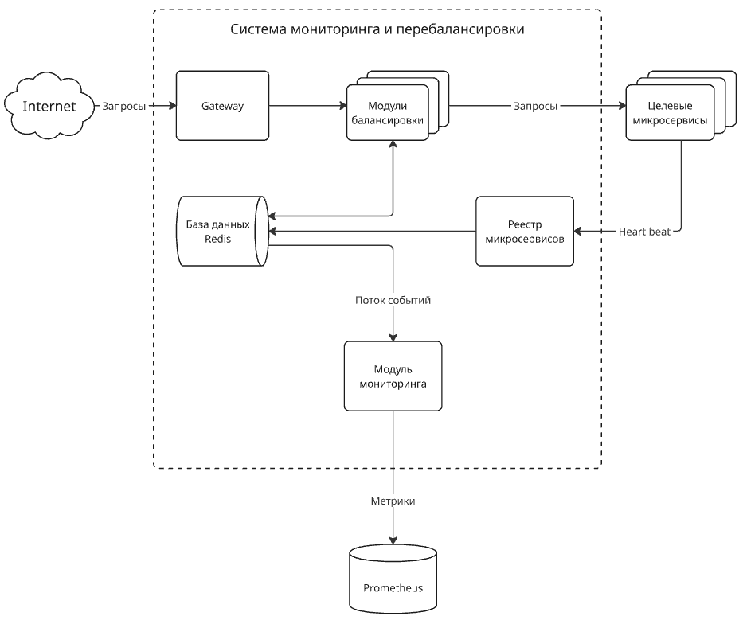

# Smart Balancer Go

Высокопроизводительная система балансировки нагрузки на базе Go и Redis, реализующая интеллектуальный алгоритм распределения запросов между микросервисами с динамическим учетом их загруженности и производительности.

## Архитектура и назначение модулей

Проект представляет собой распределенную систему из нескольких взаимодействующих компонентов, объединенных через Redis.

### `module-balancer`

**Назначение:** Основной балансировщик нагрузки, который принимает входящие HTTP-запросы и перенаправляет их на бэкенд-сервисы.

- **Интеллектуальный выбор бэкенда:** Использует продвинутый алгоритм балансировки, реализованный в `load_balancer_new.go`.
- **Механизм ограничения скорости:** Предотвращает перегрузку бэкендов, отслеживая количество запросов в реальном времени через Redis.
- **Динамическая метрика:** Выбирает бэкенд с минимальным значением `10 * rate / hurst`, где `rate` — текущая нагрузка, а `hurst` — показатель Херста, характеризующий устойчивость сервиса.
- **Проксирование:** Перенаправляет все запросы, кроме `/health`, на выбранный бэкенд с полной передачей заголовков и тела.
- **Сбор данных:** Записывает в Redis stream `monitoring.events` информацию о каждом запросе (бэкенд, путь, длительность, статус).
- **Зависимости:** FastHTTP (высокая производительность), Redis (координация и состояние), Go.

### `module-monitoring`

**Назначение:** Сервис мониторинга и аналитики, который собирает и анализирует метрики производительности бэкендов.

- **Сбор метрик:** Читает данные из Redis stream `monitoring.events` и обновляет метрики Prometheus в реальном времени.
- **Расчет показателя Херста:** Периодически вычисляет показатель Херста (Hurst Exponent) для каждого бэкенда на основе истории времени отклика, используя метод Visibility Graph.
- **Динамическое управление нагрузкой:** Передает рассчитанные значения Херста в Redis (`service.hurst.<backend>`), которые затем используются балансировщиком для принятия решений.
- **Атомарное обновление счетчиков:** Раз в секунду с помощью Lua-скрипта синхронно сбрасывает счетчики текущей нагрузки (`requests.cur.*`) и сохраняет предыдущее значение (`requests.prev.*`), обеспечивая точность расчета rate.
- **Открытые метрики:** Экспортирует метрики Prometheus на порту `:9090`.
- **Зависимости:** Prometheus Client (метрики), Redis (сбор данных), FastHTTP.

### `module-registry`

**Назначение:** Сервис регистрации и обнаружения сервисов (Service Registry).

- **Heartbeat:** Регистрирует IP-адреса микросервисов, которые отправляют на него периодические `heartbeat` запросы.
- **Динамическое обновление списка:** Формирует и хранит в Redis актуальный список работающих бэкендов в ключе `target.services`.
- **Интеграция:** Балансировщик считывает этот список при каждом запросе, что позволяет системе автоматически масштабироваться.
- **Health Check:** Предоставляет эндпоинт `/health` для проверки своего статуса.
- **Автоочистка:** Реализована периодическая проверка списка сервисов раз в секунду. Сервисы, не приславшие `heartbeat` в течение последней секунды, автоматически удаляются из списка и из ключа `target.services` в Redis.
- **Зависимости:** Redis, FastHTTP.

### `test-client`

**Назначение:** Тестовый микросервис-заглушка для имитации рабочих бэкендов.

- **Поведение:** Отвечает на все запросы, возвращая информацию о них (эхо-сервис).
- **Автоматическая регистрация:** В фоне отправляет `heartbeat` запросы на `module-registry`, автоматически регистрируясь в системе.
- **Цель:** Используется для нагрузочного тестирования и демонстрации работы балансировщика.
- **Зависимости:** Flask (Python), Requests.

## Скрипты и инфраструктура

### `compose.yml`

Основной файл для запуска всей системы в Docker Compose.

- **Orchestration:** Запускает все модули (`balancer1`, `balancer2`, `balancer3`, `registry`, `monitoring`, `test-microservice` × 20) одновременно.
- **Сетевая интеграция:** Все сервисы подключены к единой сети `service-network` для внутреннего взаимодействия.
- **Координация через Redis:** Redis используется как центральное хранилище состояния и координации.
- **Мониторинг:** Включает Prometheus и Grafana для сбора и визуализации метрик.
- **Балансировка на уровне сети:** Traefik распределяет входящий трафик между тремя экземплярами балансировщика.

### `test_startup.sh`

Скрипт для выполнения нагрузочного тестирования.

1. Собирает Docker-образ `wrk2` с кастомным Lua-скриптом.
2. Запускает нагрузочное тестирование с помощью `wrk2`, генерируя 1000 запросов в секунду в течение 15 минут.
3. Цель: `http://localhost:8080/echo`.

### `test_status_code_captor.lua`

Кастомный Lua-скрипт для `wrk2`, который переопределяет стандартное поведение и выводит статистику по HTTP-кодам ответа (в том числе 429) после завершения теста.

## Запуск системы

1. Убедитесь, что Docker и Docker Compose установлены.
2. Запустите всю систему: `docker compose up --build`
3. Запустите нагрузочное тестирование в другом терминале: `bash test_startup.sh`

После запуска:
- Веб-интерфейс: [http://localhost:8080](http://localhost:8080)
- Prometheus: [http://localhost:9090](http://localhost:9090)
- Grafana: [http://localhost:3000](http://localhost:3000) (логин: admin, пароль: admin)

## Принцип работы

1. **Регистрация:** 20 экземпляров `test-client` отправляют heartbeat на `registry`.
2. **Обнаружение:** `registry` формирует список IP и пишет его в Redis.
3. **Балансировка:** `module-balancer` читает список из Redis и перенаправляет запросы.
4. **Мониторинг:** `module-monitoring` читает статистику запросов и рассчитывает показатель Херста.
5. **Интеллект:** Балансировщик использует метрики Херста для выбора наименее перегруженного и наиболее стабильного бэкенда.